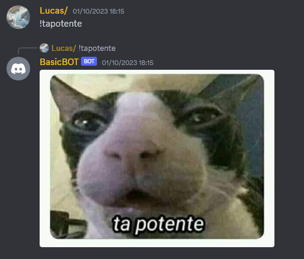
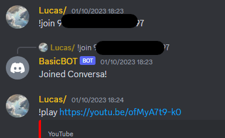

# DiscordBot

Bot para o Discord que toca música do Youtube e outras plataformas.

Desenvolvido com C# e utilizando a biblioteca DSharpPlus com LavaLink.

Não esqueça de configurar cada uma das bibliotecas (links para isso no final) e alterar a variável Token “SeuToken” no código Program.cs

Sinal de acionamento: ! (Coloque este sinal antes dos comandos)

### Comandos:
	
* tapotente  
    Envia uma foto de uma gato com a legenda “Ta potente”.
* myname  
    Envia uma mensagem dizendo qual o nome do usuário que enviou o comando de acionamento.
* random 0 10 (Ou qualquer outros números)  
    Envia um número aleatório de acordo com os que estiverem na frente do comando.

### Comandos musicais:

Não coloque o “+” 

* join + (ID do canal de voz)  
    Conecta o Bot a sala de voz desejada.
&nbsp;
* leave  
    Desconecta o Bot da sala.
&nbsp;
* play + (Algum link de qualquer plataforma suportada pelo LavaLink)  
    Toca o áudio do link.
&nbsp;
* pause  
    Pausa o áudio que está tocando.
&nbsp;

Ainda há algumas melhorias a serem feitas, mas por agora é isso.
Este projeto está servindo de estudo para outro projeto que pretendo desenvolver.

#### Links úteis:
	
* https://dsharpplus.github.io/DSharpPlus/

* https://github.com/DSharpPlus/DSharpPlus

* https://github.com/lavalink-devs/Lavalink

* https://discord.com/developers/applications
